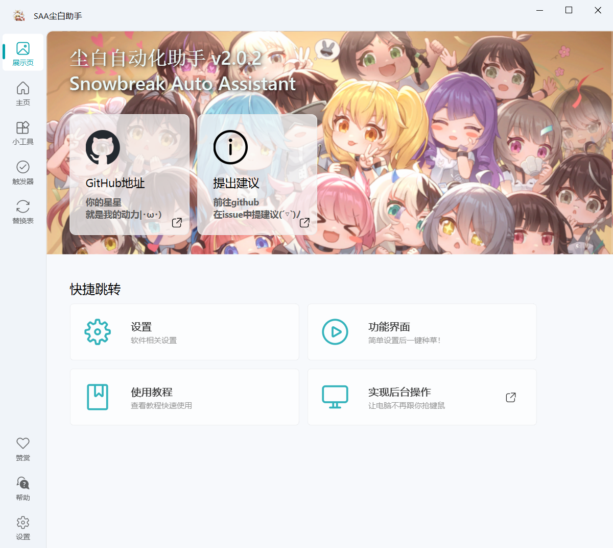
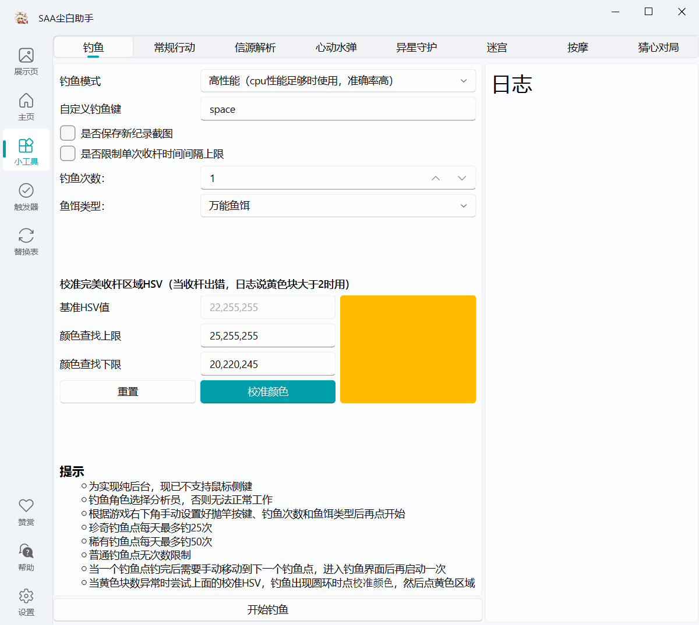
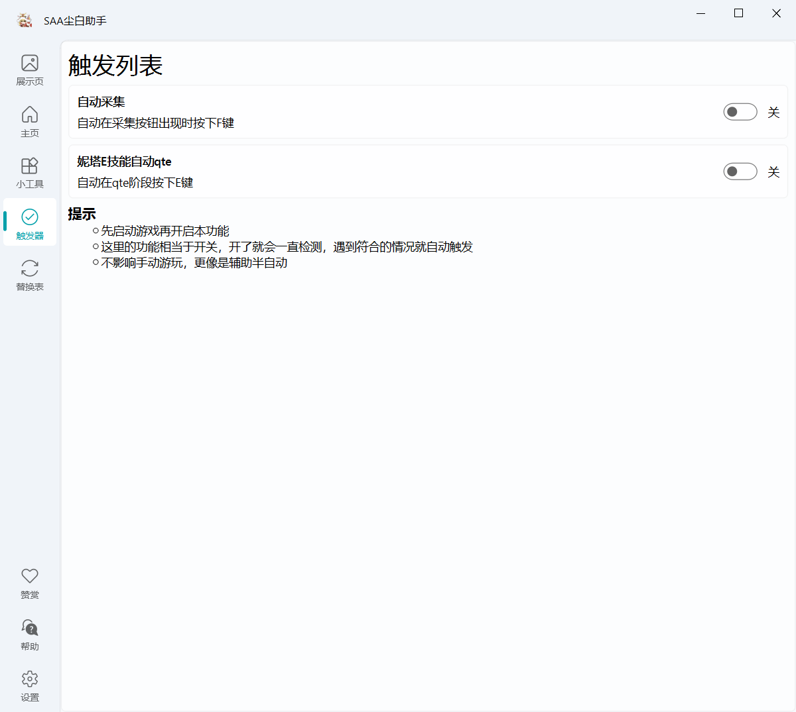

    <h1>
        
         
        尘白禁区自动化助手
    </h1>
    <h2>Snowbreak Auto Assistant</h2>
 

简体中文 | <a href="docs/README_en.md">English</a>

## ✨功能介绍

> [!Warning]
> 
> 2.0版本后所有任务支持窗口被遮挡，鼠标点击采取了一种取巧的方式最小化干扰用户操作，部分不需要鼠标操作的任务可以实现纯后台
> 只适配16:9的屏幕，支持全屏和窗口化，其他比例可以打开设置里的自动缩放功能，会自动将游戏窗口缩放并放在左上角（必须得贴着左上角）

### ✨功能列表

点击查看画大饼进度

✅ 登录游戏

✅ 领取每日物资：邮件，好友体力，供应站体力，鱼饵，宿舍拼图

✅ 商店购买

✅ 刷取活动材料

✅ 每日角色碎片

✅ 精神拟境扫荡

✅ 完成日常后领取奖励

✅ 自动钓鱼（纯后台）

✅ 信源解析方案计算

✅ 周常20关

✅ 心动水弹

✅ 验证战场（新迷宫）

✅ 异星守护（无尽和闯关）

✅ 猜心对局

✅ 妮塔E技能自动qte

✅ 深浅色适配

✅ 自动采集触发器

✅ 运行自动缩放比例

✅ 自动更新版本坐标和日程提醒

⬜ 按摩

⬜ 直接启动游戏

⬜ 开机自启

⬜ 体力恢复通知

⬜ 自动抽卡

⬜ 自动兑换兑换码

### ⚡使用说明&开发文档

> [!Important]
>
> 感谢[vmoranv](https://github.com/vmoranv)提供的文档
> 
> SAA文档站:https://saadocs.netlify.app/

演示视频:[【基于图像识别的芬妮舞狮尘白自动化代理助手-哔哩哔哩】](https://b23.tv/W9OA85k)

### ✨ 运行

👉 点击展开多张运行截图 👈

  
  
  
  

### 📌下载

- [Github Release](https://github.com/LaoZhuJackson/SnowbreakAutoAssistant/releases)

## ❤️相关项目
- OCR文字识别 https://github.com/JaidedAI/EasyOCR
- 三月七星穹铁道助手 https://github.com/moesnow/March7thAssistant
- maa明日方舟助手 https://github.com/MaaAssistantArknights/MaaAssistantArknights
- 图形界面组件库 https://github.com/zhiyiYo/PyQt-Fluent-Widgets

## 🚧SAA仓库状态

## 🌟Star 趋势

## 📝License

> [!Note]
> 
> MIT License
[LICENSE](https://github.com/LaoZhuJackson/SnowbreakAutoAssistant/blob/main/LICENSE)

## 👍赞助

- 微信

- 爱发电

