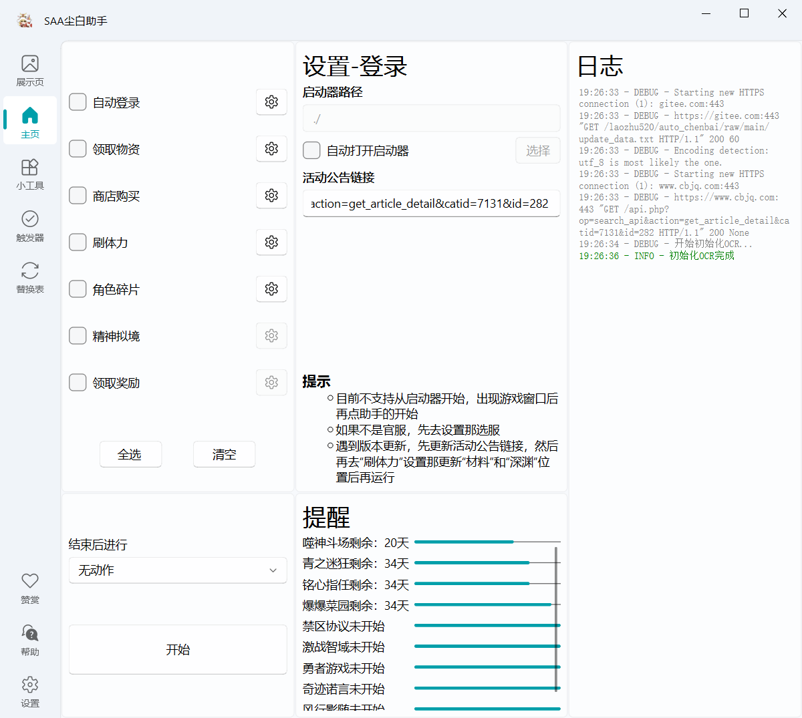

    <h1>
        
         
        Snowbreak Auto Assistant
    </h1>
    <h2>Snowbreak Auto Assistant</h2>
     

<a href="../README.md">简体中文</a> | English

## ✨Feature Introduction

> [!Warning]
>
> After version 2.0, all tasks support running while the window is obscured. Mouse clicks use an optimized method to
> minimize user disruption, enabling pure background operation for tasks not requiring mouse interaction.Only supports 16:
> 9 screen ratios. Works in both fullscreen and windowed modes. For other ratios, enable auto-scaling in settings to
> automatically resize and position the game window in the top-left corner (must be flush with the corner).

### ✨Feature List

Click to view development progress

✅ Game login

✅ Daily resource collection: Mail, friend stamina, supply station stamina, bait, dorm puzzles

✅ Shop purchases

✅ Event material farming

✅ Daily character fragments

✅ Neural Simulation sweep

✅ Daily mission reward collection

✅ Auto-fishing (pure background)

✅ Psychube analysis solution calculation

✅ Weekly 20-stage challenge

✅ Heartbeat Water Balloon

✅ Verification Battlefield (new maze)

✅ Extraterrestrial Guardian (endless & breakthrough)

✅ Mind Game

✅ Nita E-skill auto-QTE

✅ Light/dark mode adaptation

✅ Auto-collection trigger

✅ Auto-scaling ratio execution

✅ Automatic coordinate updates & schedule reminders

⬜ Massage therapy

⬜ Direct game launch

⬜ Auto-start on boot

⬜ Stamina recovery notifications

⬜ Auto-gacha

⬜ Auto-redeem codes

### ⚡ Usage & Documentation

> [!Important]
>
> Special thanks to [vmoranv](https://github.com/vmoranv) for documentation support
> SAA Documentation: https://saadocs.netlify.app/

Demo video:[【基于图像识别的芬妮舞狮尘白自动化代理助手-哔哩哔哩】](https://b23.tv/W9OA85k)

### ✨ Running

👉 Click to expand screenshots 👈

  
  
  
  

### 📌Download

- [Github Release](https://github.com/LaoZhuJackson/SnowbreakAutoAssistant/releases)

## ❤️ Related Projects

- OCR文字识别 https://github.com/JaidedAI/EasyOCR
- 三月七星穹铁道助手 https://github.com/moesnow/March7thAssistant
- maa明日方舟助手 https://github.com/MaaAssistantArknights/MaaAssistantArknights
- 图形界面组件库 https://github.com/zhiyiYo/PyQt-Fluent-Widgets

## 🚧 SAA Repository Status

## 🌟 Star History

## 📝License

> [!Note]
>
> MIT License
[LICENSE](https://github.com/LaoZhuJackson/SnowbreakAutoAssistant/blob/main/LICENSE)

## 👍 Sponsorship

- WeChat

- Afdian

