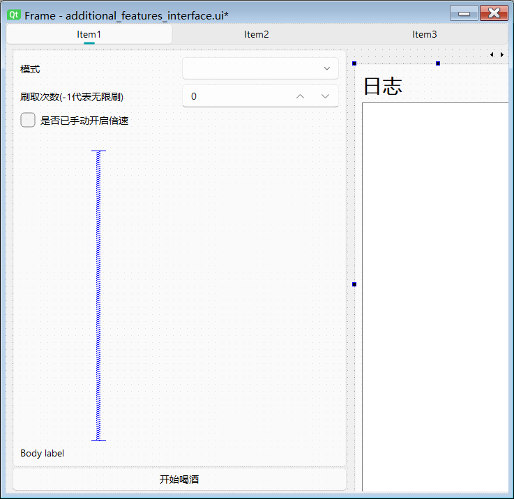

# 项目结构

```bash
SnowbreakAutoAssistant/
├── 📁 AppData/                     # 一些需要存下来的数据目录
│   ├── 📄 activity_date.json       # 展示在“提醒”上的活动起止时间
│   ├── 📄 config.json              # 用户配置
│   ├── 📄 ocr_replacements.json    # ocr识别结果替换字典
│   ├── 📄 scale_cache.json         # 加速特征匹配的缩放比例
│   └── 📄 version.txt              # 版本信息
│
├── 📁 app/                         # 核心逻辑目录
│   ├── 📁 common/                  # 常用工具目录
│   │   ├── 📄 config.py            # 文件操作工具
│   │   ├── 📄 icon.py              # 忘记了，好像没啥用
│   │   ├── 📄 image_utils.py       # 图像相关的工具
│   │   ├── 📄 logger.py            # 图像相关的工具
│   │   ├── 📄 matcher.py           # 实现模板匹配
│   │   ├── 📄 resource.py          # 转换成二进制的资源，实际也不是很需要
│   │   ├── 📄 setting.py           # 一些全局设置，也不是很重要
│   │   ├── 📄 signal_bus.py        # 信号中转站，实现全局通信
│   │   ├── 📄 singleton.py         # 实现单例
│   │   ├── 📄 style_sheet.py       # 样式
│   │   ├── 📄 updater.py           # 更新器，没用上
│   │   └── 📄 utils.py             # 普通常用工具
│   │
│   ├── 📁 modules/                 # 【加新功能在这加】各个功能模块
│   │   ├── 📁 alien_guardian/      # 异星守护
│   │   ├── 📁 automation/          # 【核心】底层自动模拟模块
│   │   │   ├── 📄 automation.py    # 【核心中的核心】基础函数实现
│   │   │   ├── 📄 input.py         # 实现后台键盘和鼠标模拟
│   │   │   ├── 📄 screenshot.py    # 后台截图
│   │   │   └── 📄 timer.py         # 计时器
│   │   ├── 📁 base_task/           # 任务基类
│   │   ├── 📁 chasm/               # 精神拟境
│   │   ├── 📁 collect_supplies/    # 收集物资
│   │   ├── 📁 drink/               # 猜心对局
│   │   ├── 📁 enter_game/          # 登入游戏
│   │   ├── 📁 fishing/             # 钓鱼
│   │   ├── 📁 get_reward/          # 收获物资
│   │   ├── 📁 jigsaw/              # 宿舍拼图
│   │   ├── 📁 massaging/           # 按摩
│   │   ├── 📁 maze/                # 验证战场迷宫
│   │   ├── 📁 ocr/                 # ocr模块
│   │   ├── 📁 person/              # 角色碎片
│   │   ├── 📁 routine_action/      # 周常行动
│   │   ├── 📁 shopping/            # 商店购买
│   │   ├── 📁 trigger/             # 触发器模块
│   │   ├── 📁 use_power/           # 使用体力
│   │   └── 📁 water_bomb/          # 心动水弹
│   │
│   ├── 📁 repackage/                   # 部分fluent widgets重写
│   │   ├── 📄 custom_message_box.py    # 消息弹窗
│   │   ├── 📄 link_card.py             # 链接卡片
│   │   ├── 📄 samplecardview.py        # 基础卡片
│   │   ├── 📄 text_edit_card.py        # 文本编辑卡
│   │   └── 📄 tree.py                  # 商店的树状勾选
│   │
│   ├── 📁 resource/                # 相关资源
│   │   ├── 📁 binary/              # 已废弃的解压工具
│   │   ├── 📁 easyocr/             # easyocr相关模型
│   │   ├── 📁 i18n/                # 没用上
│   │   ├── 📁 images/              # 图像资源，各种截图
│   │   ├── 📁 qss/                 # 不同主题对应的样式
│   │   ├── 📄 help.md              # 内嵌的帮助文档（很久没更新了）
│   │   └── 📄 resource.qrc         # 指明资源路径
│   │
│   ├── 📁 ui/                                        # ui文件（.py靠生成）
│   │   ├── 📄 additional_features_interface.py       # .ui生成的对应.py文件
│   │   ├── 📄 additional_features_interface.ui       # 可用qt designer手动编辑的文件
│   │   ├── 📄 ...                                    # 其他gui对应的文件
│   │   └── 📄 ...       
│   │
│   └── 📁 view/                                      # 继承调用ui/下的文件，实现页面响应逻辑
│       ├── 📄 additional_features.py                 # .ui生成的对应.py文件
│       ├── 📄 additional_features_interface.ui       # 可用qt designer手动编辑的文件
│       ├── 📄 ...                                    # 其他gui对应的文件
│       └── 📄 ... 
│
├── 📁 asset/                   # github上README以及saa内需要展示的资源图
│
├── 📁 docs/                    # 文档
│
├── 📁 logs/                    # 日志目录
│
├── 📁 patch/                   # 一些补丁包（有点忘了是干啥的了）
│
├── 📁 PerfectBuild/            # 构建安装包
│
├── 📁 test/                    # 测试文件
│
├── 📄 main.py                  # 应用启动入口
├── 📄 requirements.txt         # Python依赖清单
├── 📄 .gitignore               # Git忽略规则
├── 📄 LICENSE                  # 开源许可证
├── 📄 README.md                # 项目概述文档
└── 📄 update_data.txt          # 版本更新就更新这个文件
```

# 前言

大佬如果发现架构不合理或者看不懂的，那一定是我的问题，这是孩子不懂事写着玩的。但如果你依然对这个项目感兴趣的话可以继续往下看，这里并不会全面讲解整个项目的搭建，而是重点讲解核心部分，以及快速让大佬明白要是想加模块的话需要知道些什么，并且知道该往哪加，怎么加。

**以下介绍建议一边看讲解一边看对应的代码，因为我也是这么写的，你跟着做更容易理解**

# 你需要知道的一些底层实现

## 如何实现的后台截图和后台键鼠模拟？

让我们先移步到app/modules/automation/下，这个目录就是这个问题的答案


* input.py：实现后台的核心库是`win32gui`
  ，不一定所有游戏都支持这个库输入，目前已知的是使用虚幻引擎，窗口类型为UnrealWindow的游戏支持这个库(如上图)
  * 鼠标动作，鼠标按下的具体按键由`message`的值控制
    * 点击：一次完整点击由`mouse_down` + 停顿 + `mouse_up`组成。主要调用的是win32gui.PostMessage(hwnd, message, wparam,
      lparam)
      * `move_click`
        ：尘白专供，尘白的点击会检测鼠标，如果点击时鼠标不在附近，游戏内只能看到点击特效但是点击不生效，所以这个函数加入了对用户鼠标移动的判断，在鼠标不移动的时候快速移动到对应位置点击然后再返回原位置，快速瞬移实现“假后台”点击
      * `mouse_click`：真后台，不抢鼠标，后台按键点击，默认左键
      * `mouse_down`：鼠标按下，可以指定按键, 默认左键
      * `mouse_up`：鼠标抬起，可以指定按键, 默认左键
    * 滚轮`mouse_scroll`
  * 键盘动作
    * 按键按下`key_down`
    * 按键松开`key_up`
    * 一次完整的键盘模拟：`key_press` = `key_down`+ 停顿 + `key_up`
* screenshot.py：实现后台的核心部分如下

```python
# 进行截图
user32 = ctypes.windll.user32
# 启动器0,1,2均可以，但是游戏窗口必须要是2,0和1都是黑屏，2: 捕捉包括窗口的边框、标题栏以及整个窗口的内容
user32.PrintWindow(hwnd, save_dc.GetSafeHdc(), 2)  # PW_RENDERFULLCONTENT=2
# 转换为 numpy 数组
bmpinfo = bitmap.GetInfo()
bmpstr = bitmap.GetBitmapBits(True)
# img_size = np.frombuffer(bmpstr, dtype=np.uint8).size
img = np.frombuffer(bmpstr, dtype=np.uint8).reshape((bmpinfo['bmHeight'], bmpinfo['bmWidth'], 4))
```

*
automation.py：在实现了上述两个模块后搭出来的常用组合操作，一个值得注意的点是`当前文件里面的函数都被我视为原子函数，都加上一个修饰器，在用户点击中断时就是以这些操作为基本单位中断`
，以下只介绍常用函数
  * `find_element`：寻找元素，支持传入截图路径和文本，提取指定颜色，匹配前是否更新截图（可以不更新截图继续用上次截图情况可以置False，加快速度）
  * `click_element`：找到元素得到坐标后添加点击操作再封装的一个函数，添加了噪声干扰，使每次点击的位置都不是相同坐标
  * `click_element_with_pos`
    ：固定坐标点击，这个调用方法比较特殊。例如`auto.click_element_with_pos((int(1103 / auto.scale_x), int(762 / auto.scale_y)))`
    ，传入的坐标（1103,762）是在1920*1080的尺度下的，也就是1920.1080是缩放的基准值（看`screenshot.py`
    的171行能理解）。这样经过scale_x，scale_y的转换后才能正确转换到对应用户屏幕的坐标
  * 以上是三个最常用的，其他的函数最好也看看，注释都很明确，有写特殊需求的时候会用到，避免重复造轮子。如果要写新的组合操作，也是往这里添加

## 如何实现ocr文字识别？

这里踩过一些坑，比如paddleocr会内存泄漏，比如现在用的easyocr不支持调用A卡。如果有更好的最好选择那个更好的。这里讲一些额外需要注意的点

* ocr识别速度问题：传入的图最好经过裁剪并且是只包含需要识别部分的最小区域，这样可以加快识别的速度，必要的时候也可以先对传入的图片文字进行黑白化提取，增加对比度
*
坐标转换问题：通常ocr识别后都会在返回结果中给出识别的文字相对你传入的图的坐标，此时你传入的图的左上角是（0,0）原点，得到的坐标并不是相对游戏画面的，此时需要对结果进行坐标系转换，转换方法看`screenshot.py`
的具体实现
*
错别字问题：识别结果通常会因为游戏使用了特殊字体或者字过小导致识别出错，这是ocr模型的问题，毕竟这个模型不是针对这个游戏训练的，此时需要有一套错别字替换机制，这也是`AppData/ocr_replacements.json`
的作用。在获得ocr结果后先根据这个文件里面的替换规则进行对应的处理替换，而代码作者面对一些错别字的时候往里面新增替换规则就好了

## 如何进行统一的日志管理？

那就要移步至`app/common/logger.py`了，注意点如下：

* 全局单例使用一个logger
* log的显示与关闭可控
* 格式化
* 可保存
  关于logger实际上肯定有更好的方案，有更好的还是选择更好的

# 你已经知道大体框架了，现在去写一个saa的功能吧

## 如何往小工具里添加新模块

想尝试开发的大佬可能需要满足以下要求

* 用过qt designer，会用外部工具将.ui转换为.py。或者会改pyqt前端代码，或者知道在写好接口后让琉璃过来写前端
* 你的屏幕是16:9的
* 电脑支持运行代码的同时还能运行一个尘白
* 会用deepseek，会查百度，会自学的大佬可以忽略上述要求。
  那让我们实操一下把，以最近添加的酒馆功能为例

1. 通过之前的目录结构可以知道，`app/modules/`目录放置的都是写好的模块，所以第一步就是来这里创建一个新文件夹，并且新建好对应的文件。


2. ~~新建好文件夹后就可以开始摸鱼了~~接下来看看里面的具体结构

```python
    def __init__(self, auto, logger):
  super().__init__()
  self.mode = None
  self.drink_times = None
  self.auto = auto
  self.logger = logger
  self.enter_success = False
  self.select_list = ['分析员', '析员', '天降鸿运', '多喝热水']

  self.is_log = False
```

init需要传入auto这个原子类的实例，之后调用操作都是通过auto.click_element()等方式，另一个要传入的是logger，用于展示日志到对应控件

```python
    def run(self):
  self.is_log = config.isLog.value  # 读取配置
  self.drink_times = config.SpinBox_drink_times.value  # 读取配置
  self.mode = config.ComboBox_card_mode.value  # 读取配置
  self.enter_drink()  # 调用子函数
```

* 每个模块都应该实现一个run()，之后线程直接调用的就是run函数
* 在run函数内获取config里面的配置，这样用户在期间改了设置，下次启动的时候会自动读取最新的更改
* 子函数由开发者自行拆分，比如酒馆我分成了进入对局+对局内循环逻辑。你要是全写在run内也行，就是可读性不高

```python
    def 子函数(self):
  timeout = Timer(30).start()
  while True:
    self.auto.take_screenshot()  # 每次循环开始先调用这个函数更新截图
    if 退出情况1:
      退出前处理逻辑
      break  # 子函数完成，退出while循环
    if 退出情况2:
      退出前处理逻辑
      break  # 子函数完成，退出while循环
    ...

    if 遇到了状态1:
      状态1对应处理逻辑
      continue  # 是否用continue进入下一轮循环取决于你的操作是否已完成，并且游戏画面是否变了需要更新截图
    if 遇到了状态2:
      状态2对应处理逻辑
      continue  # 是否用continue进入下一轮循环取决于你的操作是否已完成，并且游戏画面是否变了需要更新截图
    ...

    # 超时退出
    if timeout.reached():
      self.logger.error("进入酒馆超时")
      break
```

* 我们在这里定义游戏中的每个画面为“状态”，出现需要点击的按钮算一个状态，游戏进入到下一个画面后做了另一个状态。
* 每个子函数基本都是以上的循环遍历检测结构，这样做有多个好处：最大程度利用性能、能从任意状态开始，用户不管处于哪个状态，点击开始后匹配到他的状态后就能进行对应操作。无需卡死用户非得进入某个步骤再开启助手
* 必须要设置计时器和超时退出的逻辑，这是作为如果流程没有按我们的想法正常运行而卡进死循环的最后救命稻草，所以需要在最开始的timer里设置好合适的超时时长，这里我设置的是30秒
* 最后所有子函数最后都会像搭积木一样组合在run函数中

3. 画前端ui



* 打开qt designer，导入`app/ui/additional_features_interface.ui`后添加ui，其实每个小工具的ui都是一致的，创建一个新的页面然后复制就好了
* 然后使用pyqt工具将.ui转换为.py(不懂如何转换的建议百度一下，这里就不贴教程了)

4. 功能对接，来到这你已经打败99%的大佬了
   来到`app/view/additional_features.py`

```python
def _initWidget(self):
  self.SegmentedWidget.addItem(self.page_card.objectName(), '猜心对局',
                               onClick=lambda: self.stackedWidget.setCurrentWidget(self.page_card))
  self.BodyLabel_tip_card.setText(
    "### 提示\n* 进入站在猜心对局入口位置后再点开始\n* 两种模式均无策略，目的均是为了快速结束对局刷下一把\n* 逻辑：有质疑直接质疑，轮到自己出牌时出中间的那一张\n* 实测有赢有输，挂着刷经验就行")
  mode_card_items = ['标准模式（速刷经验）', '秘盒奇袭（刷经验成就）']
  self.ComboBox_card_mode.addItems(mode_card_items)
```

绑定页面、添加提示信息、为下拉框添加选项

```python
def _connect_to_slot(self):
  ...
  self.PushButton_start_drink.clicked.connect(self.on_drink_button_click)
```

添加点击跳转

```python
def on_drink_button_click(self):
  """酒馆开始按键的信号处理"""
  if not self.is_running_drink:
    self.redirectOutput(self.textBrowser_log_card)
    self.drink_task = SubTask(DrinkModule)
    self.drink_task.is_running.connect(self.handle_drink)
    self.drink_task.start()
  else:
    self.drink_task.stop()


def handle_drink(self, is_running):
  """钓鱼线程开始与结束的信号处理"""
  if is_running:
    self.set_simple_card_enable(self.SimpleCardWidget_card, False)
    self.PushButton_start_drink.setText('停止喝酒')
    self.is_running_drink = True
  else:
    self.set_simple_card_enable(self.SimpleCardWidget_card, True)
    self.PushButton_start_drink.setText('开始喝酒')
    self.is_running_drink = False
```

这两个是每个模块都固定有的函数，往上看看你会发现每个模块都有这两个函数，用于对接线程调用以及实现开始和结束逻辑，只需要复制粘贴然后改成对应的变量名就好了

5. 测试
   所有都写完了就来到测试部分了，起码功能得运行起来吧。不过一般我的开发步骤是先对接好前端然后再一边测试一边写子函数逻辑
6. 提交代码
   当你认为功能完善得不错之后，就可以选择提交代码了，可以在github提一个pull require，或者直接联系琉璃整合你写的代码

# 结语

到这你已经打败100%的大佬了。实际上这个项目没遵循任何架构规范，因为我压根不知道有什么规范，文档也没有多官方，只是写出了我自己的开发流程。肯定有写得不好的地方和存在很多没有完善的说明。但是还是很感谢你能看到这里，这说明我为一个好奇且充满热情的灵魂提供了一些技术上的非正式解答，希望你玩得开心。